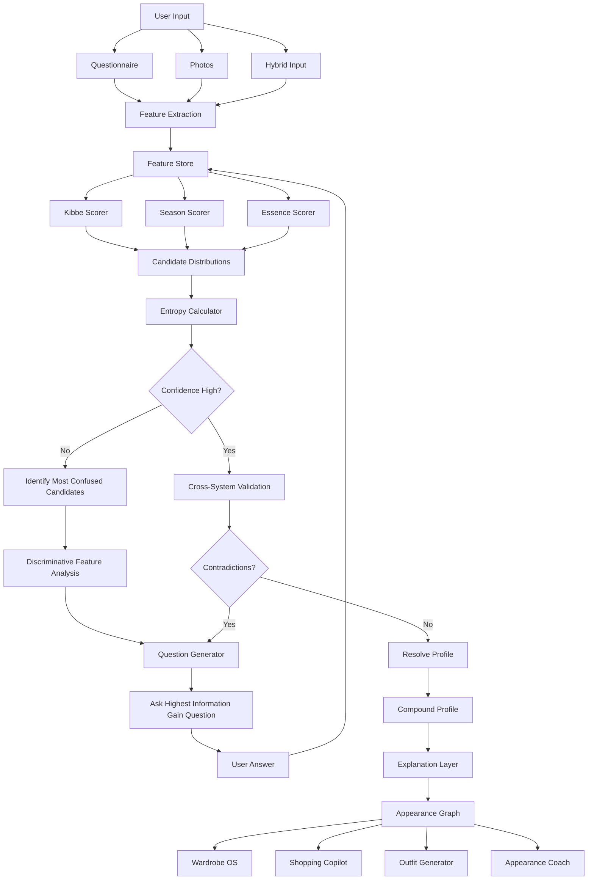
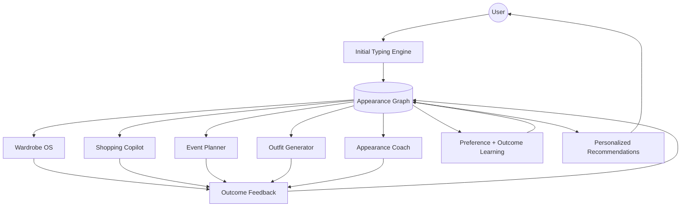

# 1

```mermaid
flowchart TD

    A[User Input]

    A --> B1[Questionnaire]
    A --> B2[Photos]
    A --> B3[Hybrid Input]

    B1 --> C[Feature Extraction]
    B2 --> C
    B3 --> C

    C --> D[Feature Store]

    D --> E1[Kibbe Scorer]
    D --> E2[Season Scorer]
    D --> E3[Essence Scorer]

    E1 --> F[Candidate Distributions]
    E2 --> F
    E3 --> F

    F --> G[Entropy Calculator]

    G --> H{Confidence High?}

    H -->|No| I[Identify Most Confused Candidates]

    I --> J[Discriminative Feature Analysis]

    J --> K[Question Generator]

    K --> L[Ask Highest Information Gain Question]

    L --> M[User Answer]

    M --> D

    H -->|Yes| N[Cross-System Validation]

    N --> O{Contradictions?}

    O -->|Yes| K

    O -->|No| P[Resolve Profile]

    P --> Q[Compound Profile]

    Q --> R[Explanation Layer]

    R --> S[Appearance Graph]

    S --> T1[Wardrobe OS]
    S --> T2[Shopping Copilot]
    S --> T3[Outfit Generator]
    S --> T4[Appearance Coach]
```
# 2 

```mermaid
flowchart LR

    Input[User Input]

    Input --> FE

    subgraph FE[Feature Extraction Layer]
        FE1[Form Feature Extractor]
        FE2[Vision Feature Extractor]
    end

    FE --> SC

    subgraph SC[Inference Layer]
        A1[Archetype Scorer]
        A2[Candidate Retriever]
        A3[Distribution Builder]
    end

    SC --> UC

    subgraph UC[Uncertainty Layer]
        U1[Entropy Calculator]
        U2[Ambiguity Detector]
        U3[Confidence Estimator]
    end

    UC --> Decision

    Decision{Resolved?}

    Decision -->|No| QA

    subgraph QA[Resolution Layer]
        Q1[Confusion Pair Finder]
        Q2[Information Gain Analyzer]
        Q3[Question Generator]
    end

    QA --> UserAnswer[User Answer]

    UserAnswer --> FE

    Decision -->|Yes| VAL

    subgraph VAL[Validation Layer]
        V1[Kibbe Validator]
        V2[Season Validator]
        V3[Essence Validator]
        V4[Cross-System Reconciliation]
    end

    VAL --> Profile[Compound Profile]

    Profile --> EXP

    subgraph EXP[Explanation Layer]
        E1[Reasoning Engine]
        E2[Natural Language Explainer]
    end

    EXP --> Graph[Appearance Graph]
```

# 3
# Continuous Appearance Intelligence System

```mermaid
flowchart TB

    User((User))

    User --> Typing[Initial Typing Engine]

    Typing --> Graph[(Appearance Graph)]

    Graph --> Wardrobe[Wardrobe OS]
    Graph --> Shopping[Shopping Copilot]
    Graph --> Events[Event Planner]
    Graph --> Outfits[Outfit Generator]
    Graph --> Coach[Appearance Coach]

    Wardrobe --> Feedback
    Shopping --> Feedback
    Events --> Feedback
    Outfits --> Feedback
    Coach --> Feedback

    Feedback[Outcome Feedback]

    Feedback --> Graph

    Graph --> Learning[Preference + Outcome Learning]

    Learning --> Graph

    Graph --> Recommendations

    Recommendations[Personalized Recommendations]

    Recommendations --> User
```
